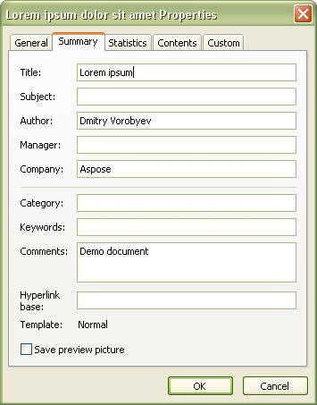

Document properties allow some useful information to be stored along with the document. There is a system (built-in) and user-defined (custom) properties. Built-in properties contain such things as document title, author's name, document statistics, and so on. Custom properties are just name-value pairs where the user defines both the name and value. You can use document properties in your document automation project to store some useful info along with the document such as when the document was received/processed/time stamped and so on. 

{} 

Aspose.Words directly writes the information about API and Version Number in output documents. For example, upon converting Document to DOC, Aspose.Words for C++ writes 8 bytes for AWC.17.9. You can check it by opening the file in some binary editor.

Please note that you cannot instruct Aspose.Words for C++ to change or remove this information from output Documents..

{} 

## Accessing Document Properties in Microsoft Word

You can access document properties in Microsoft Word by using the File | Properties menu.

## Accessing Document Properties in Aspose.Words

To access document properties in Aspose.Words do the following:

- To obtain built-in document properties, use [Document.BuiltInDocumentProperties](https://apireference.aspose.com/words/cpp/class/aspose.words.properties.built_in_document_properties/).
- To obtain custom document properties, use [Document.CustomDocumentProperties](https://apireference.aspose.com/words/cpp/class/aspose.words.properties.custom_document_properties/).

**Document.BuiltInDocumentProperties** returns a [BuiltInDocumentProperties](https://apireference.aspose.com/words/cpp/class/aspose.words.properties.built_in_document_properties/) object and **Document.CustomDocumentProperties** returns a [CustomDocumentProperties](https://apireference.aspose.com/words/cpp/class/aspose.words.properties.custom_document_properties/) object. Both objects are collections of the [DocumentProperty](https://apireference.aspose.com/words/cpp/class/aspose.words.properties.document_property) objects. These objects can be obtained through the indexer property either by name or by index. **BuiltInDocumentProperties** additionally provides access to the document properties via a set of typed properties that return values of the appropriate type. **CustomDocumentProperties** allows adding or removing document properties from the document. The following code example demonstrates how to enumerates through all built-in and custom properties in a document. You can download the template file of this example from [here](https://github.com/aspose-words/Aspose.Words-for-C/blob/master/Data/Programming-Documents/Document/Properties.doc).



The DocumentProperty class allows you to get the name, value, and type of the document property:

- To get the name of a property, use [DocumentProperty.Name](https://apireference.aspose.com/words/cpp/class/aspose.words.properties.document_property#ac3d0fab901e0df734b00aba64efacc43).
- To get the value of a property, use [DocumentProperty.Value](https://apireference.aspose.com/words/cpp/class/aspose.words.properties.document_property#ad71d5c7702950973d4290506ffb0c6f3). **DocumentProperty.Value** returns an Object, but there is a set of methods allowing you to get the value of the property converted to a particular type.
- To get the type of a property, use [DocumentProperty.Type](https://apireference.aspose.com/words/cpp/class/aspose.words.properties.document_property#ab947996e0d79548e6afe4f0e8a9f5b49). This returns one of the [PropertyType](http://www.aspose.com/api/net/words/aspose.words.properties/propertytype) enumeration values. After you get to know what type the property is, you can use one of the **DocumentProperty.ToXXX** methods such as [DocumentProperty.ToString](https://apireference.aspose.com/words/cpp/class/aspose.words.properties.document_property#aa72dd172db59c902679905c0b83f9e3e) and [DocumentProperty.ToInt](https://apireference.aspose.com/words/cpp/class/aspose.words.properties.document_property#a9c7b459dff09a22f2dddcd687e9fe8fb) to obtain the value of the appropriate type instead of getting **DocumentProperty.Value**.

## Updating Built-In Document Properties

While Microsoft Word automatically updates some document properties when needed, Aspose.Words never automatically change any properties. For example, Microsoft Word updates the time the document was last printed, last saved, updates statistical properties (word, paragraph, character etc counts). Aspose.Words does not update any properties automatically but provides a method for updating some statistical built-in document properties. Call the [Document.UpdateWordCount](https://apireference.aspose.com/words/cpp/class/aspose.words.document#a1828e1ccbb5d7936fd248401b0c8deee) method to recalculate and update the [BuiltInDocumentProperties.Characters](https://apireference.aspose.com/words/cpp/class/aspose.words.properties.built_in_document_properties#ab5319940a69f96f39eccfd348a0394f9) , [BuiltInDocumentProperties.CharactersWithSpaces](https://apireference.aspose.com/words/cpp/class/aspose.words.properties.built_in_document_properties#a3c682a63e3dec93c1a5a10b7f8ee4373) , [BuiltInDocumentProperties.Words](https://apireference.aspose.com/words/cpp/class/aspose.words.properties.built_in_document_properties#af22aef4479030762efad9fca8474bbcd) and [BuiltInDocumentProperties.Paragraphs](https://apireference.aspose.com/words/cpp/class/aspose.words.properties.built_in_document_properties#abf2e8427ab4b8df1fecd456b88dd2e19) properties in the **BuiltInDocumentProperties** collection. This will ensure they are synchronized with changes made after the document was opened or created.

## Adding or Removing Document Properties

You cannot add or remove built-in document properties in Aspose.Words, you can only change their values. To add custom document properties in Aspose.Words, use [CustomDocumentProperties.Add](https://apireference.aspose.com/words/cpp/class/aspose.words.properties.custom_document_properties#a2d5b0a04653aaa1ce7d51e78c6b02661) passing the name of the new property and the value of the appropriate type. The method returns the newly created **DocumentProperty** object. The following code example demonstrates how to checks if a custom property with a given name exists in a document and adds few more custom document properties. You can download the template file of this example from [here](https://github.com/aspose-words/Aspose.Words-for-C/blob/master/Data/Programming-Documents/Document/Properties.doc).



To remove custom properties, use DocumentPropertyCollection.Remove passing it the name of the property to remove. The following code example demonstrates how to removes a custom document property.



## Configure Link to Content Property

Aspose.Words provides a method **CustomDocumentProperties.AddLinkToContent(string, string)** to create a new linked to content custom document property which returns the newly created property object or null if the [link source](https://apireference.aspose.com/words/cpp/class/aspose.words.properties.document_property#a35260f5a310ddffa12404091688e4242) is invalid. The following code example demonstrates how to configure the link to a content custom property.



## Removing Personal Information from Document

If you want to share a Word document with other people, you can remove personal information, such as the author's name and company. You can use the Document.RemovePersonalInformation property to set the flag indicating that Microsoft Word will remove all user information from comments, revisions and document properties upon saving the document. 

Setting this option does not actually remove personal information while a document is processed in Aspose.Words and affects only Microsoft Word behavior.

## Getting Document Variables

You can get a collection of document variables using the [Document.Variables](https://apireference.aspose.com/words/cpp/class/aspose.words.document#a84f1b3dd74ce4b7fe77753bbfda5810c) property. Variable names and values are strings. The following code example demonstrates how to enumerate over document variables. You can download the template file of this example from [here](https://github.com/aspose-words/Aspose.Words-for-C/blob/master/Data/Programming-Documents/Document/Properties.doc).



## How to Convert Between Measurement Units

Most of the object properties provided in the Aspose.Words API that represent some measurement (width/height, margins and various distances) accept values in points (1 inch equals 72 points). Sometimes this is not convenient so there is the ConvertUtil class that provides helper functions to convert between various measurement units. It allows converting inches to points, points to inches, pixels to points, and points to pixels. When pixels are converted to points and vice versa, it can be performed at 96 dpi (dots per inch) resolutions or at the specified dpi resolution.
**ConvertUtil** is very useful when setting different page properties because for instance inches are more usual measurement units than points. The following example demonstrates how to set up the page properties in inches. The cod examples gien below shows how to specify page properties in inches.


