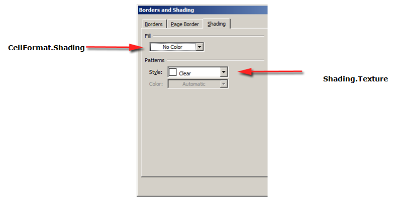

## Formatting Overview

{} 

Each element of a table can be applied with different formatting. For instance, table formatting will be applied over the entire table while row formatting will only affect particular rows etc.

Aspose.Words provides a rich API to retrieve and apply formatting to a table. You can use the [Table](https://apireference.aspose.com/words/java/com.aspose.words/table), [RowFormat](https://apireference.aspose.com/words//java/com.aspose.words/rowformat) and [CellFormat](https://apireference.aspose.com/words/java/com.aspose.words/CellFormat) nodes to set formatting.

{} 

## Applying Formatting on the Table Level

To apply formatting to a table you can use the properties available on the corresponding [Table](https://apireference.aspose.com/words//java/com.aspose.words/table) node. A visual view of table formatting features in Microsoft Word and their corresponding properties in Aspose.Words are given below.

The following code example shows how to apply an outline border to a table.



The following code example shows how to build a table with all borders enabled (grid).



Note that before you apply table properties there must be at least one row present in the table. This means when building a table using [DocumentBuilder](https://apireference.aspose.com/words/java/com.aspose.words/DocumentBuilder), such formatting must be done after the first call to [DocumentBuilder.InsertCell](https://apireference.aspose.com/words/java/com.aspose.words/documentbuilder#insertCell()) or after adding the first row to a table or when inserting nodes directly into the DOM.

## Applying Formatting on the Row Level

Formatting on the row level can be controlled using the [RowFormat](https://apireference.aspose.com/words/java/com.aspose.words/rowformat) property of the [Row](https://apireference.aspose.com/words/java/com.aspose.words/row).

The following code example shows how to modify the formatting of a table row.



## Applying Formatting on the Cell Level

Formatting on the cell level is controlled using the [CellFormat](https://apireference.aspose.com/words/java/com.aspose.words/CellFormat) property of the [Cell](https://apireference.aspose.com/words/java/com.aspose.words/Cell).

The following code example shows how to modify the formatting of a table cell.



The following code example shows how to set the amount of space (in points) to add to the left/top/right/bottom of the contents of the cell.



## Specifying Row Heights

The height of a table row is controlled using height and height rule properties. These can be set differently for each row in the table which allows for wide control over the height of each row. In Aspose.Words these are represented by the [RowFormat.Height](https://apireference.aspose.com/words/java/com.aspose.words/rowformat#Height) and [RowFormat.HeightRule](https://apireference.aspose.com/words/java/com.aspose.words/rowformat#HeightRule) properties of the given [Row](https://apireference.aspose.com/words/java/com.aspose.words/row).

|HeightRule Value|Description|
| :- | :- |
|Auto|This is the default height rule given to a new row. Technically this means that no height rule is defined. The row is sized to fit the largest content within the cells of the row.|
|At Least|With this setting, the height of the row will grow to accommodate the content of the row, but will never be smaller than the specified size in [RowFormat.Height](https://apireference.aspose.com/words/java/com.aspose.words/rowformat#Height).|
|Exactly|The size of the row is set exactly to the value found in [RowFormat.Height]https://apireference.aspose.com/words/java/com.aspose.words/rowformat#Height) and does not grow to fit the content.|
{} 

The simplest way to set row height is by using DocumentBuilder. Using the appropriate RowFormat properties you can set a default height setting or apply a different height for each row in the table.

{} 

The following code example shows how to create a table that contains a single cell and apply row formatting.



## Applying Borders and Shading

Borders and shading can be applied either table wide using [Table.setBorder(int,int,double,java.awt.Color,boolean)](https://apireference.aspose.com/words/java/com.aspose.words/table#setBorder(int,int,double,java.awt.Color,boolean)), [Table.setBorders(int,double,java.awt.Color)](https://apireference.aspose.com/words/java/com.aspose.words/table#setBorders(int,double,java.awt.Color)) and [Table.setShading(int,java.awt.Color,java.awt.Color)](https://apireference.aspose.com/words/java/com.aspose.words/table#setShading(int,java.awt.Color,java.awt.Color)) or to particular cells only by using [CellFormat.getBorders()](https://apireference.aspose.com/words/java/com.aspose.words/cellformat#Borders) and [CellFormat.getShading()](https://apireference.aspose.com/words/java/com.aspose.words/cellformat#Shading). Additionally borders can be set on a row by using [RowFormat.getBorders()](https://apireference.aspose.com/words/java/com.aspose.words/rowformat#Borders), however shading cannot be applied in this way.

The following code example shows how to format a table and cell with different borders and shadings.



## Get Distance between Table and Surrounding Text

The following code example shows how to get the distance between the table and its surrounding text. 



## Table Position

### How to Get the Table's Alignment

If the table's text wrapping is *Around*, you can get the table's horizontal and vertical alignment using Table.getRelativeHorizontalAlignment() and Table.getRelativeVerticalAlignment() properties. In other cases, you can get a table's inline alignment using Table.getAlignment() property. Below example shows how to get the table's alignment.



### Get Position of Floating Table

The following code example shows how to get the position of the floating table. 



### Set Position of Floating Table

Aspose.Words API provides the following properties to set the position of the floating table in the word document:

- [RelativeHorizontalAlignment](https://apireference.aspose.com/words/java/com.aspose.words/table#RelativeHorizontalAlignment)
- [AbsoluteHorizontalDistance](https://apireference.aspose.com/words/java/com.aspose.words/table#AbsoluteHorizontalDistance)
- [RelativeVerticalAlignment](https://apireference.aspose.com/words/java/com.aspose.words/table#RelativeVerticalAlignment)
- [AbsoluteVerticalDistance](https://apireference.aspose.com/words/java/com.aspose.words/table#AbsoluteVerticalDistance).

The alignment and distance horizontally and vertically are combined properties and one can reset the other. For example, while setting RelativeHorizontalAlignment, it will reset AbsoluteHorizontalDistance to its default value and vice versa. The same is the case with vertical positioning. The following code example demonstrates how to set the position of the floating table. 





## Working with Alternative Text of Table

The title and description of the table provides alternative text-based representations of the information contained in the table. MS Word allows setting this information (*Right-click the table, click Table Properties, click the Alt Text tab, and then set the title and description of the table*). With Aspose.Words you can achieve this by using Table.Title and Table.Description properties. These properties are meaningful for ISO/IEC 29500 compliant DOCX documents. When saved to pre-ISO/IEC 29500 formats, these properties are ignored. The following code example shows how to set the table's title and description properties.



## Allow Spacing Between Cells

MS Word does not add any additional space between the cells in a table by default. You can find this option in the table's properties in MS Word. You can get or set "Allow spacing between cells" option using the Table.AllowCellSpacing property. The following code example shows how to set space between cells.


